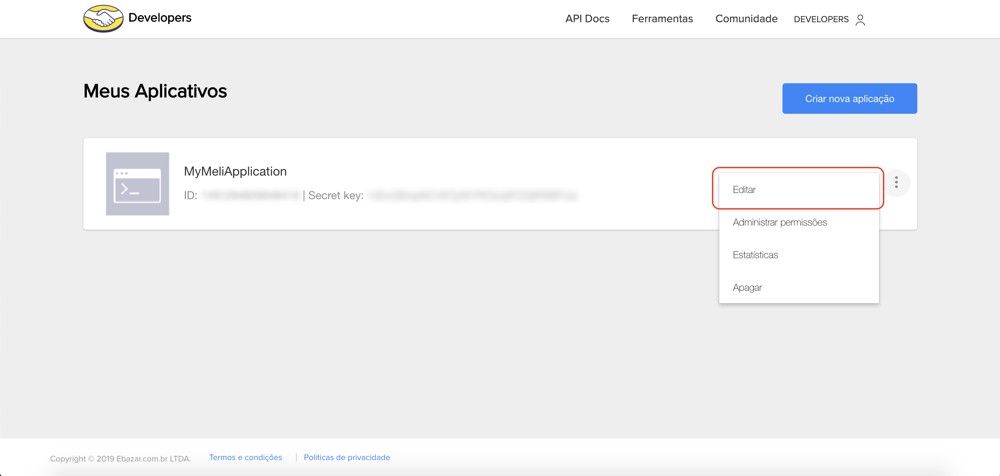
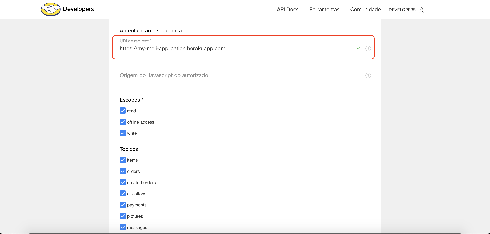
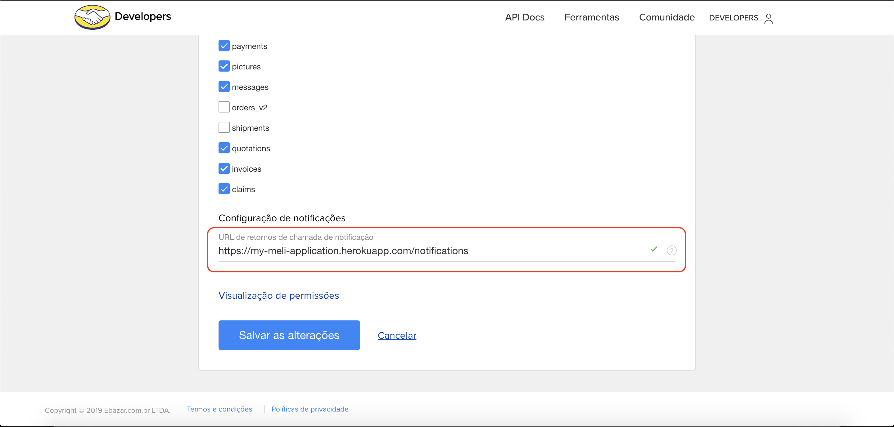

# Mercado Livre - My First App

Para mais informações, visite: https://developers.mercadolivre.com.br.

Para seguir este tutorial, você precisará ter instalado:
- Git (https://git-scm.com/downloads)
- Node.js (https://nodejs.org/en/download)

Utilizaremos o Git na versão 2.20.1 e o Node.js na versão 12.3.1, mas recomendamos sempre utilizar as versões estáveis mais atualizadas.
___

# Modo fast

1. Clique no botão para fazer o deploy:

    [](https://heroku.com/deploy?template=https://github.com/Anonimy/MercadoLivreApplication)

2. Vá ao seu projeto no Heroku e configure as variáveis de ambiente como no print abaixo:


3. Sua integração está pronta para ser usada! :)
___

# Modo DIY

## Setup do projeto

- Crie o diretório do projeto e vá até ele no seu terminal.

- Rode o comando `npm init -y` para inicializar um projeto em Node.js. Vários arquivos devem ser gerados no seu diretório.

- Agora vamos instalar as dependências que utilizaremos no decorrer do projeto. Rode o comando `npm install --save mercadolibre express ejs dotenv multer helmet cookie-session`.
  - **mercadolibre**: esse é o SDK do Mercado Livre, que irá auxiliar/facilitar o desenvolvimento da nossa integração.

  - **express**: facilitará o desenvolvimento da nossa aplicação em Node.js.

  - **ejs**: irá trabalhar junto com o express no auxílio do desenvolvimento da aplicação, facilitando a troca de informações entre o servidor e o cliente.

  - **dotenv**: permitirá inserir variáveis de ambiente definidos em um arquivo *.env* no nosso código.

  - **multer**: facilitará o upload de arquivos (envio de fotos para o Mercado Livre).

  - **helmet**: criará uma camada de proteção para sua aplicação Node.js.

  - **cookie-session**: será responsável pelo gerenciamento dos dados de session (para validar um usuário logado, por exemplo).

___

## Início do desenvolvimento

- Crie um arquivo chamado `app.js` no seu diretório.

- Crie um novo diretório chamado `bin`, e dentro desse novo diretório, um arquivo chamado `www`. Nele, iremos fazer o setup da aplicação.

- Dentro do arquivo `app.js`, preencha com o seguinte trecho de código:
  ```js
  const express = require('express');
  const app = express();
  module.exports = app;
  ```
  No trecho acima, importamos a dependência **express**, geramos um objeto que representa toda a nossa aplicação e exportamos ela do arquivo `app.js`.

- Agora, dentro do arquivo `www`, preenchemos com o seguinte código:
  ```js
  #!/usr/bin/env node

  const app = require('../app');
  const http = require('http');

  const port = process.env.PORT || 3000;
  app.set('port', port);

  const server = http.createServer(app);
  server.listen(port);
  server.on('error', handleError);
  server.on('listening', handleStartListening);

  function handleError(error) {
    if (error) {
      switch (error.code) {
        case 'EACCES':
          console.error(`${port} requires elevated privileges`);
          process.exit(1);
          break;
        case 'EADDRINUSE':
          console.error(`${port} is already in use`);
          process.exit(1);
          break;
      }
    }
    throw error;
  }

  function handleStartListening() {
    console.log(`Listening on port ${server.address().port}`)
  }
  ```
  No trecho acima, declaramos para os sistemas operacionais Unix que o arquivo sem extensão `www` deve ser interpretado como "node", definimos a porta que utilizaremos, criamos uma instância do nosso servidor e iniciamos efetivamente o servidor.
  
  Basicamente, isso significa que o arquivo responsável por deixar nosso servidor aberto ou fechado é o arquivo `www`.

- Para facilitar que possamos abrir ou fechar o servidor quando quisermos, abra o arquivo `package.json`. Ele deve se parecer com isso:
  ```json
  {
    "name": "mercadolibre-app",
    "version": "1.0.0",
    "description": "",
    "main": "index.js",
    "scripts": {
      "test": "echo \"Error: no test specified\" && exit 1"
    },
    "keywords": [],
    "author": "",
    "license": "ISC",
    "dependencies": {
      "dotenv": "^8.0.0",
      "ejs": "^2.6.2",
      "express": "^4.17.1",
      "mercadolibre": "0.0.13",
      "multer": "^1.4.2"
    }
  }
  ```
  O `package.json` é um arquivo com informações gerais do seu projeto e serve para gerenciar sua aplicação e vincular com o *npm* (**N**ode **P**ackage **M**anager). Há uma propriedade chamada "scripts" que permite que você execute comandos através do npm. Utilizaremos essa propriedade para abrir nosso servidor localmente.

- Dentro de "scripts", Apague o script "test" que vem pré-definido e adicione a seguinte propriedade:
  ```json
  {
    "start": "node ./bin/www"
  }
  ```

- Após definido o script de inicialização no `package.json`, vamos começar a fazer a parte visual da nossa integração. Crie um diretório chamado `views`. Dentro do diretório que acabamos de criar, crie um arquivo `index.ejs`. Essa será nossa página principal. Preencha com o seguinte trecho de código:
  ```html
  <!DOCTYPE html>
  <html lang="en">
  <head>
    <meta charset="UTF-8">
    <meta name="viewport" content="width=device-width, initial-scale=1.0">
    <meta http-equiv="X-UA-Compatible" content="ie=edge">
    <title>My Meli Application</title>
  </head>
  <body>
    <h1>Welcome to your own new MeliApplication!</h1>
    <form action="/login" method="POST">
      <label for="password">Senha:</label>
      <input type="password" name="password" id="password" />
      <button type="submit">Let's begin!</button>
    </form>
  </body>
  </html>
  ```

- Uma vez que temos nosso visual definido, vamos ligá-la ao servidor que criamos. Vamos aproveitar para também fazermos uma rota de login e a criação de uma session para manter o seu usuário logado e sua aplicação protegida. Podemos fazer isso modificando o arquivo `app.js` da seguinte forma:
  ```js
  const express = require('express');
  const app = express();
  const path = require('path');
  const helmet = require('helmet');
  const session = require('cookie-session');

  app.set('views', path.join(__dirname, 'views'));
  app.set('view engine', 'ejs');

  app.use(helmet());
  app.use(session({
    name: 'session',
    keys: ['bd7126f457237e4aab0d47124ce4aac2', '9009def68579d15d871a5bf346422839'],
    cookie: {
      httpOnly: true,
      expires: new Date(Date.now() + 60 * 60 * 1000 * 6) // 6 horas
    },
  }));
  app.use(express.urlencoded({ extended: false }));

  app.get('/', (req, res) => {
    res.render('index');
  });

  app.post('/login', (req, res) => {
    if (req.body.password === 'pwd') {
      req.session.user = true;
      res.redirect('/home');
    } else {
      res.redirect('/?error=senha-incorreta');
    }
  });

  module.exports = app;
  ```

- Teste sua aplicação rodando o comando `npm start` no terminal! A senha padrão que colocamos é "pwd", mas iremos modificar isso na próxima seção.
  > Lembre-se de que você pode parar a aplicação a qualquer momento pressionando as teclas **Ctrl**+**C**
____

## Crie uma aplicação no Mercado Livre

Agora que temos uma aplicação em Node.js pronta, é hora de criarmos nossa aplicação dentro do Mercado Livre.

- Para isso, acesse: https://developers.mercadolivre.com.br/devcenter.

- Clique em "Criar nova aplicação".

- Preencha todos os dados obrigatórios, e em "URI de redirect" preencha com a raiz do domínio:


- Em "Tópicos", você pode selecionar os tópicos que você tem interesse em receber notificações, e em "URL de retornos de chamada de notificação", iremos configurar uma rota de notificações.

  O Mercado Livre irá fazer requisições para essa rota sempre que ocorrer algo relevante dentre os tópicos selecionados. Para mais informações, veja: https://developers.mercadolivre.com.br/pt_br/produto-receba-notificacoes.

  Por agora, você pode preencher da seguinte forma:
  

- Uma vez criada sua aplicação, você será redirecionado de volta à página inicial, na qual sua aplicação será listada. Nessa listagem, você pode ver o ID e a Secret Key que sua aplicação expõe. Com esses valores podemos começar a nossa integração!

> Lembre-se de que "localhost" é uma URL provisória que será substituída pela URL fornecida pelo Heroku, depois que fizermos o deploy!
___

## Integração do app com o Mercado Livre

A primeira coisa que devemos fazer é inserir o ID e a Secret Key da nossa aplicação no nosso projeto Node.js. Para manter a aplicação mais segura, recomendamos manter esses valores em variáveis de ambiente. No nosso exemplo, vamos manter em um arquivo `.env`.

Todo arquivo que inicia-se com um ponto é tratado como um arquivo oculto pelos sistemas operacionais. Caso você gere o arquivo e ele não esteja aparecendo, procure como você pode fazer para que seu sistema operacional mostre arquivos ocultos.

Para proteger nossas variáveis de ambiente, o arquivo `.env` nunca será compartilhado com outras pessoas e nunca irá para plataformas de controle de versão e colaboração de código (como o GitHub, GitLab, Bitbucket, etc.). Para mantermos a segurança e ao mesmo tempo a informação de que alguns valores serão lidos de um arquivo `.env`, podemos manter um arquivo `.env.example`, que irá segurar somente as chaves que serão lidas, mas sem o valor.

- Crie um arquivo `.env.example` e preencha da seguinte forma:
  ```
  CLIENT_ID=
  CLIENT_SECRET=
  REDIRECT_URI=
  SYS_PWD=
  ```

- Depois, crie um arquivo `.env`. Ele será uma cópia de `.env.example`, porém nesse arquivo, sim, adicione os valores imediatamente após os sinais de igual:
  ```
  CLIENT_ID={PREENCHA COM O VALOR DO ID INFORMADO PELO MERCADO LIVRE}
  CLIENT_SECRET={PREENCHA COM A SECRET KEY INFORMADA PELO MERCADO LIVRE}
  REDIRECT_URI=http://localhost:3000
  SYS_PWD={PREENCHA COM A SENHA QUE VOCÊ UTILIZARÁ NO SISTEMA}
  ```

- Para importarmos essas variáveis de ambiente no nosso código, utilizaremos a dependência **dotenv**. Modifique seu código no arquivo `app.js` dessa forma:
  ```js
  const express = require('express');
  const app = express();
  const path = require('path');
  const helmet = require('helmet');
  const session = require('cookie-session');
  require('dotenv').config();

  const { CLIENT_ID, CLIENT_SECRET, SYS_PWD } = process.env;

  app.set('views', path.join(__dirname, 'views'));
  app.set('view engine', 'ejs');

  app.use(helmet());
  app.use(session({
    name: 'session',
    keys: ['bd7126f457237e4aab0d47124ce4aac2', '9009def68579d15d871a5bf346422839'],
    cookie: {
      httpOnly: true,
      expires: new Date(Date.now() + 60 * 60 * 1000 * 6) // 6 horas
    },
  }));
  app.use(express.urlencoded({ extended: false }));

  app.get('/', (req, res) => {
    res.render('index');
  });

  app.post('/login', (req, res) => {
    if (req.body.password === SYS_PWD) {
      req.session.user = true;
      res.redirect('/home');
    } else {
      res.redirect('/?error=senha-incorreta');
    }
  });

  module.exports = app;
  ```

- Com as variáveis de ambiente, podemos importar a SDK do Mercado Livre e começar as nossas requisições. A primeira coisa a se fazer é criar uma camada de autenticação e autorização. O Mercado Livre trabalha com o protocolo OAuth, e o fluxo funciona da seguinte forma:
  - Primeiro, deve haver uma autorização do usuário para utilizar sua aplicação. O usuário será redirecionado ao Mercado Livre, no qual pode fazer login e autorizar.

  - Uma vez que é autorizado, o usuário será redirecionado de volta à sua página, mas com um código que servirá para requisitar o *access_token*.

  - A aplicação faz a requisição do *access_token* utilizando o código fornecido, que será validado pelo Mercado Livre.

  - Com o *access_token*, a aplicação pode utilizar os recursos do Mercado Livre de forma completa!

  - A cada 6 horas, o *access_token* expira e a aplicação deve requisitar um novo.

- Com a ajuda do SDK do Mercado Livre, vamos criar um **middleware** que irá sempre validar se temos um *access_token* válido. Em caso afirmativo, seguimos normalmente. Em caso negativo, iremos fazer todo o fluxo de OAuth.

- Para começar, crie um novo diretório com o nome de `middlewares`. Dentro do novo diretório, crie um arquivo `tokens.js` e preencha-o com o seguinte código:
  ```js
  const meli = require('mercadolibre');
  require('dotenv').config();

  const { CLIENT_ID, CLIENT_SECRET, REDIRECT_URI } = process.env;

  const tokens = {
    access_token: null,
    expires: null,
  };

  const setTokens = (newTokens) => {
    const date = new Date();
    const time_threshold = 6; // o token do mercadolivre dura até 6 horas
    date.setHours(date.getHours() + time_threshold, 0, 0, 0);
    tokens.expires = date;
    tokens.access_token = newTokens.access_token;
  };

  const validateToken = (req, res, next) => {
    if (req.session.user) {
      if (!tokens.access_token || (new Date()) >= tokens.expires) {
        const redirect_uri = REDIRECT_URI + req.baseUrl + req.path;
        const { code } = req.query;
        const meliObject = new meli.Meli(CLIENT_ID, CLIENT_SECRET);
        if (code) {
          meliObject.authorize(code, redirect_uri, (error, response) => {
            if (error) {
              throw error;
            }
            setTokens(response);
            res.locals.access_token = tokens.access_token;
            res.redirect(redirect_uri);
          });
        } else {
          res.redirect(meliObject.getAuthURL(redirect_uri));
        }
      } else {
        res.locals.access_token = tokens.access_token;
        next();
      }
    } else {
      res.redirect('/');
    }
  }

  module.exports = {
    validateToken
  };
  ```

- No trecho acima:
  - Declaramos um objeto **tokens**, que será responsável por manter nosso *access_token* pelo tempo de seis horas (ou enquanto o servidor estiver online);

  - Declaramos uma função **setTokens**, responsável por gravar o valor e o momento de expiração do *access_token* para futura validação;

  - Declaramos uma função **validateToken**, responsável por validar o token atual e, se já tivermos um *access_token* válido, apenas segue para a rota normalmente. Porém, se não tivermos, faz o processo de redirecionamento para o Mercado Livre, passando a URL atual como "URI de redirecionamento".

Agora que temos nosso *access_token*, podemos começar a consumir os recursos do Mercado Livre.

A SDK do Mercado Livre é pensada para trabalhar com o Node.js a partir da versão 6, para que funcione bem para todos. Entretanto há recursos das versões mais recentes do Node.js que facilitarão a escrita e leitura do código. Para convertermos o código para a versão mais recente, podemos criar **_utils_** que farão esse auxílio:

- Crie um novo diretório `utils` e, dentro do novo diretório, crie um arquivo `index.js`.

- Complete com o seguinte trecho de código:
  ```js
  const meli_get = (meliObject, url, params = null) => (
    new Promise((resolve, reject) => {
      meliObject.get(url, params, (err, result) => {
        if (err) {
          reject(err);
        } else {
          resolve(result);
        }
      });
    })
  );

  module.exports = {
    meli_get
  };
  ```

- De volta ao arquivo `app.js`, vamos criar uma rota **/home** que irá carregar uma página na qual você poderá cadastrar seus produtos! Atualize o código para que se pareça com o seguinte trecho:
  ```js
  const express = require('express');
  const app = express();
  const path = require('path');
  const helmet = require('helmet');
  const session = require('cookie-session');
  require('dotenv').config();
  const meli = require('mercadolibre');
  const { validateToken } = require('./middlewares/tokens');
  const { meli_get } = require('./utils');

  const { CLIENT_ID, CLIENT_SECRET, SYS_PWD } = process.env;

  app.set('views', path.join(__dirname, 'views'));
  app.set('view engine', 'ejs');

  app.use(helmet());
  app.use(session({
    name: 'session',
    keys: ['bd7126f457237e4aab0d47124ce4aac2', '9009def68579d15d871a5bf346422839'],
    cookie: {
      httpOnly: true,
      expires: new Date(Date.now() + 60 * 60 * 1000 * 6) // 6 horas
    },
  }));
  app.use(express.urlencoded({ extended: false }));

  app.get('/', (req, res) => {
    res.render('index');
  });

  app.post('/login', (req, res) => {
    if (req.body.password === SYS_PWD) {
      req.session.user = true;
      res.redirect('/home');
    } else {
      res.redirect('/?error=senha-incorreta');
    }
  });

  app.get('/home', validateToken, async (req, res) => {
    try {
      const meliObject = new meli.Meli(CLIENT_ID, CLIENT_SECRET, res.locals.access_token);
      const user = await meli_get(meliObject, '/users/me');
      const currencies = await meli_get(meliObject, '/currencies');
      const listing_types = await meli_get(meliObject, `/sites/${user.site_id}/listing_types`);
      res.render('home', {
        user,
        currencies,
        listing_types
      });
    } catch (err) {
      console.log('Something went wrong', err);
      res.status(500).send(`Error! ${err}`);
    }
  });

  module.exports = app;
  ```

- Agora crie um arquivo `home.ejs` no diretório `views` e preencha-o com o seguinte código:
  ```html
  <!DOCTYPE html>
  <html lang="en">
  <head>
    <meta charset="UTF-8">
    <meta name="viewport" content="width=device-width, initial-scale=1.0">
    <meta http-equiv="X-UA-Compatible" content="ie=edge">
    <title>Home - My Meli Application</title>
  </head>
  <body>
    <p><b>all posts:</b><br /><a href="/posts">let's go!</a></p>

    <form action="/post" method="POST" enctype="multipart/form-data">
      <div>
        <label for="title">Título da publicação:</label>
        <input type="text" name="title" id="title" value="Item de Teste – Por favor, NÃO OFERTAR!" />
      </div>
      <div>
        <label for="price">Preço:</label>
        <input type="text" name="price" id="price" value="9999.99" />
      </div>
      <div>
        <label for="quantity">Quantidade disponível:</label>
        <input type="text" name="quantity" id="quantity" value="1" />
      </div>
      <div>
        <label for="select__currency">Selecione a moeda:</label>
        <select id="select__currency" name="currency">
          <% for (var i = 0; i < currencies.length; i++) { %>
            <option value="<%= currencies[i].id %>">
              <%= currencies[i].description %> (<%= currencies[i].symbol %>)
            </option>
          <% } %>
        </select>
      </div>
      <div>
        <label for="select__listing_type">Selecione o tipo de listagem:</label>
        <select id="select__listing_type" name="listing_type">
          <% for (var i = 0; i < listing_types.length; i++) { %>
            <option value="<%= listing_types[i].id %>">
              <%= listing_types[i].name %>
            </option>
          <% } %>
        </select>
      </div>
      <div>
        <label>Selecione a condição do produto:</label>
        <label for="condition__new">
          <input checked type="radio" name="condition" id="condition__new" value="new" /> Novo
        </label>
        &nbsp;&nbsp;&nbsp;&nbsp;
        <label for="condition__used">
          <input type="radio" name="condition" id="condition__used" value="used" /> Usado
        </label>
      </div>
      <div>
        <label for="description">Descrição do produto:</label><br />
        <textarea name="description" id="description" cols="25" rows="5">Descrição de teste :)</textarea>
      </div>
      <div>
        <label for="picture">Foto do produto:</label>
        <input type="file" name="picture" id="picture" />
      </div>
      <div>
        <button type="submit">Publicar</button>
      </div>
    </form>
  </body>
  </html>
  ```

Pronto! Você começou a trabalhar na sua nova integração, fazendo requests de usuários, moedas e *listing types*.
___

## Publicação de produtos

Criamos uma página com um formulário para criar novas publicações, mas ainda não estamos publicando nenhum item, de fato! Faremos isso nesta seção!

> Lembre-se de que você deve ter o cadastro completo no Mercado Livre para que possa vender através da plataforma! Verifique se você tem um endereço de venda e telefone cadastrados!

- A primeira coisa a fazer é adaptar nosso código para que funcione o upload de arquivos, para que possamos subir e servir nossas imagens. Para isso, utilizaremos a dependência **multer**. Preencha o arquivo `app.js` para que fique da seguinte forma:
  ```js
  const express = require('express');
  const app = express();
  const path = require('path');
  const helmet = require('helmet');
  const session = require('cookie-session');
  require('dotenv').config();
  const meli = require('mercadolibre');
  const { validateToken } = require('./middlewares/tokens');
  const { meli_get } = require('./utils');
  const multer = require('multer');

  const { CLIENT_ID, CLIENT_SECRET, SYS_PWD } = process.env;

  const storage = multer.diskStorage({
    destination: (req, file, cb) => cb(null, './public/pictures'),
    filename: (req, file, cb) => cb(null, Date.now() + file.originalname)
  });

  const upload = multer({ storage });

  app.set('views', path.join(__dirname, 'views'));
  app.set('view engine', 'ejs');

  app.use(helmet());
  app.use(session({
    name: 'session',
    keys: ['bd7126f457237e4aab0d47124ce4aac2', '9009def68579d15d871a5bf346422839'],
    cookie: {
      httpOnly: true,
      expires: new Date(Date.now() + 60 * 60 * 1000 * 6) // 6 horas
    },
  }));
  app.use(express.urlencoded({ extended: false }));
  app.use(express.static(path.join(__dirname, 'public')));

  app.get('/', (req, res) => {
    res.render('index');
  });

  app.post('/login', (req, res) => {
    if (req.body.password === SYS_PWD) {
      req.session.user = true;
      res.redirect('/home');
    } else {
      res.redirect('/?error=senha-incorreta');
    }
  });

  app.get('/home', validateToken, async (req, res) => {
    try {
      const meliObject = new meli.Meli(CLIENT_ID, CLIENT_SECRET, res.locals.access_token);
      const user = await meli_get(meliObject, '/users/me');
      const currencies = await meli_get(meliObject, '/currencies');
      const listing_types = await meli_get(meliObject, `/sites/${user.site_id}/listing_types`);
      res.render('home', {
        user,
        currencies,
        listing_types
      });
    } catch (err) {
      console.log('Something went wrong', err);
      res.status(500).send(`Error! ${err}`);
    }
  });

  app.post('/post', validateToken, upload.single('picture'), async (req, res) => {
    res.send('ok');
  });

  module.exports = app;
  ```
  No trecho acima, criamos nossa instância do **multer** utilizando algumas opções de *disk storage* que irão prevenir que alguns erros, como o upload de arquivos de mesmo nome, ocorram.

- Agora vamos fazer a publicação ocorrer, de fato. Uma coisa importante a se reparar é que na tela Home não enviamos categorias (que é um fator obrigatório de uma publicação no Mercado Livre). Isso é proposital, pois vamos utilizar o preditor de categorias do próprio Mercado Livre. Preencha o arquivo `app.js` para que fique da seguinte forma:
  ```js
  const express = require('express');
  const app = express();
  const path = require('path');
  const helmet = require('helmet');
  const session = require('cookie-session');
  require('dotenv').config();
  const meli = require('mercadolibre');
  const { validateToken } = require('./middlewares/tokens');
  const { meli_get } = require('./utils');
  const multer = require('multer');

  const { CLIENT_ID, CLIENT_SECRET, SYS_PWD } = process.env;

  const storage = multer.diskStorage({
    destination: (req, file, cb) => cb(null, './public/pictures'),
    filename: (req, file, cb) => cb(null, Date.now() + file.originalname)
  });

  const upload = multer({ storage });

  app.set('views', path.join(__dirname, 'views'));
  app.set('view engine', 'ejs');

  app.use(helmet());
  app.use(session({
    name: 'session',
    keys: ['bd7126f457237e4aab0d47124ce4aac2', '9009def68579d15d871a5bf346422839'],
    cookie: {
      httpOnly: true,
      expires: new Date(Date.now() + 60 * 60 * 1000 * 6) // 6 horas
    },
  }));
  app.use(express.urlencoded({ extended: false }));
  app.use(express.static(path.join(__dirname, 'public')));

  app.get('/', (req, res) => {
    res.render('index');
  });

  app.post('/login', (req, res) => {
    if (req.body.password === SYS_PWD) {
      req.session.user = true;
      res.redirect('/home');
    } else {
      res.redirect('/?error=senha-incorreta');
    }
  });

  app.get('/home', validateToken, async (req, res) => {
    try {
      const meliObject = new meli.Meli(CLIENT_ID, CLIENT_SECRET, res.locals.access_token);
      const user = await meli_get(meliObject, '/users/me');
      const currencies = await meli_get(meliObject, '/currencies');
      const listing_types = await meli_get(meliObject, `/sites/${user.site_id}/listing_types`);
      res.render('home', {
        user,
        currencies,
        listing_types
      });
    } catch (err) {
      console.log('Something went wrong', err);
      res.status(500).send(`Error! ${err}`);
    }
  });

  app.post('/post', validateToken, upload.single('picture'), async (req, res) => {
    try {
      const meliObject = new meli.Meli(CLIENT_ID, CLIENT_SECRET, res.locals.access_token);
      const user = await meli_get(meliObject, '/users/me');
      const predict = await meli_get(meliObject, `/sites/${user.site_id}/category_predictor/predict?title=${encodeURIComponent(req.body.title)}`);
      const body = {
        title: req.body.title,
        category_id: predict.id,
        price: req.body.price,
        currency_id: req.body.currency,
        available_quantity: req.body.quantity,
        buying_mode: 'buy_it_now',
        listing_type_id: req.body.listing_type,
        condition: req.body.condition,
        description: req.body.description,
        tags: [ 'immediate_payment' ],
        pictures: [
          {
            source: `${req.protocol}://${req.get('host')}/pictures/${req.file.filename}`
          }
        ]
      };
      meliObject.post('/items', body, null, (err, response) => {
        if (err) {
          throw err;
        } else {
          console.log('publicado na categoria:', predict.name);
          console.log('category probability (0-1):', predict.prediction_probability, predict.variations);
          res.send(response);
        }
      });
    } catch(err) {
      console.log('Something went wrong', err);
      res.status(500).send(`Error! ${err}`);
    }
  });

  module.exports = app;
  ```
  Feito isso, podemos rodar novamente o `npm start` e testar nossa aplicação!
___

## Deploy para o Heroku

- Primeiramente, rode o comando `node --version` no terminal. Essa informação é requerida pelo Heroku para configurar o servidor corretamente.

- Sabendo qual a versão do Node.js, vá ao arquivo `package.json` e, ao final do arquivo, adicione uma propriedade "engines". O arquivo deveria se parecer com o seguinte:
  ```json
  {
    "name": "mercadolibre-app",
    "version": "1.0.0",
    "description": "",
    "main": "index.js",
    "scripts": {
      "start": "node ./bin/www"
    },
    "keywords": [],
    "author": "",
    "license": "ISC",
    "dependencies": {
      "dotenv": "^8.0.0",
      "ejs": "^2.6.2",
      "express": "^4.17.1",
      "mercadolibre": "0.0.13",
      "multer": "^1.4.2"
    },
    "engines": {
      "node": "12.3.1"
    }
  }
  ```

- Agora vamos configurar o arquivo `.gitignore`. Utilizaremos a API do [gitignore.io](https://gitignore.io/) para não termos que nos preocupar com o que colocar. Você pode preencher conforme o seu próprio ambiente, mas no nosso caso, vamos preencher com [macOS, Visual Studio Code e Node](https://gitignore.io/api/node,macos,visualstudiocode).

- Crie um arquivo chamado `.gitignore`. Lembre-se de que arquivos que começam com um ponto são considerados arquivos ocultos.

- Copie o texto do [gitignore.io](https://gitignore.io/) e cole no seu arquivo.

- Feito isso, você precisará instalar o CLI do Heroku. Você pode fazer isso acessando o link: https://devcenter.heroku.com/articles/heroku-cli#download-and-install

- Utilizaremos o git para enviar o projeto para o Heroku. Rode o comando `git init`. Depois, rode o comando `git add .` e, por último, o comando `git commit -m "first commit"`. Você pode trocar a mensagem "first commit" por qualquer mensagem que desejar.

- Faça login no Heroku através da sua linha de comando, utilizando o comando `heroku login`.

- Para criar um app no Heroku, rode o comando `heroku create my-meli-application`. Você pode trocar "my-meli-application" por qualquer nome que quiser. Para mais informações, [cheque a documentação do Heroku](https://devcenter.heroku.com/articles/creating-apps).

- Para subir os arquivos ao servidor do Heroku, rode o comando `git push heroku master`.

- Lembrando que as variáveis do arquivo `.env` não devem subir diretamente ao servidor. Existe um modo de configurar variáveis de ambiente no Heroku direto pela linha de comando. Para configurar cada variável de ambiente, rode os comandos abaixo:
  - `heroku config:set CLIENT_ID={INSIRA O ID DA APLICAÇÃO AQUI}`
  
  - `heroku config:set CLIENT_SECRET={INSIRA A KEY SECRET DA APLICAÇÃO AQUI}`
  
  - `heroku config:set REDIRECT_URI=https://my-meli-application.herokuapp.com`

  - `heroku config:set SYS_PWD={INSIRA COM A SENHA QUE VOCÊ UTILIZARÁ AQUI}`

- E, por fim, para ver sua aplicação funcionando, rode o comando `heroku open`.
___

## Ajustes no Mercado Livre

Agora que você publicou a sua primeira aplicação, a URL já não é mais em localhost. Precisamos voltar ao devcenter do Mercado Livre para realizar os ajustes necessários.

- Acesse https://developers.mercadolivre.com.br/devcenter.

- Clique nos três pontos e depois em "editar" para editar a aplicação:


- Modifique a "URI de redirect" para a nova forcenida pelo Heroku (essa URI deve ser a mesma configurada no arquivo `.env`, na variável `REDIRECT_URI`):


- Modifique, também, a "URL de retornos de chamada de notificação":


___

## Configuração de notificações no código

Agora que temos uma rota exposta, o Mercado Livre consegue fazer requisições para nossa aplicação sempre que algo interessante acontece com os tópicos selecionados na sua aplicação. Nós dissemos que as notificações devem chegar em "https://my-meli-application.herokuapp.com/notifications", então vamos configurar essa rota.

- Abra o arquivo `app.js` e modifique-o para que fique da seguinte forma:
  ```js
  const express = require('express');
  const app = express();
  const path = require('path');
  const helmet = require('helmet');
  const session = require('cookie-session');
  require('dotenv').config();
  const meli = require('mercadolibre');
  const { validateToken } = require('./middlewares/tokens');
  const { meli_get } = require('./utils');
  const multer = require('multer');

  const { CLIENT_ID, CLIENT_SECRET, SYS_PWD } = process.env;

  const storage = multer.diskStorage({
    destination: (req, file, cb) => cb(null, './public/pictures'),
    filename: (req, file, cb) => cb(null, Date.now() + file.originalname)
  });

  const upload = multer({ storage });

  app.set('views', path.join(__dirname, 'views'));
  app.set('view engine', 'ejs');
  app.use(helmet());
  app.use(session({
    name: 'session',
    keys: ['bd7126f457237e4aab0d47124ce4aac2', '9009def68579d15d871a5bf346422839'],
    cookie: {
      httpOnly: true,
      expires: new Date(Date.now() + 60 * 60 * 1000 * 6) // 6 horas
    },
  }));
  app.use(express.urlencoded({ extended: false }));
  app.use(express.static(path.join(__dirname, 'public')));
  app.use(express.json());

  app.get('/', (req, res) => {
    res.render('index');
  });

  app.post('/login', (req, res) => {
    if (req.body.password === SYS_PWD) {
      req.session.user = true;
      res.redirect('/home');
    } else {
      res.redirect('/?error=senha-incorreta');
    }
  });

  app.get('/home', validateToken, async (req, res) => {
    try {
      const meliObject = new meli.Meli(CLIENT_ID, CLIENT_SECRET, res.locals.access_token);
      const user = await meli_get(meliObject, '/users/me');
      const currencies = await meli_get(meliObject, '/currencies');
      const listing_types = await meli_get(meliObject, `/sites/${user.site_id}/listing_types`);
      res.render('home', {
        user,
        currencies,
        listing_types
      });
    } catch (err) {
      console.log('Something went wrong', err);
      res.status(500).send(`Error! ${err}`);
    }
  });

  app.post('/post', validateToken, upload.single('picture'), async (req, res) => {
    try {
      const meliObject = new meli.Meli(CLIENT_ID, CLIENT_SECRET, res.locals.access_token);
      const user = await meli_get(meliObject, '/users/me');
      const predict = await meli_get(meliObject, `/sites/${user.site_id}/category_predictor/predict?title=${encodeURIComponent(req.body.title)}`);
      const body = {
        title: req.body.title,
        category_id: predict.id,
        price: req.body.price,
        currency_id: req.body.currency,
        available_quantity: req.body.quantity,
        buying_mode: 'buy_it_now',
        listing_type_id: req.body.listing_type,
        condition: req.body.condition,
        description: req.body.description,
        tags: [ 'immediate_payment' ],
        pictures: [
          {
            source: `${req.protocol}://${req.get('host')}/pictures/${req.file.filename}`
          }
        ]
      };
      meliObject.post('/items', body, null, (err, response) => {
        if (err) {
          throw err;
        } else {
          console.log('publicado na categoria:', predict.name);
          console.log('category probability (0-1):', predict.prediction_probability, predict.variations);
          res.send(response);
        }
      });
    } catch(err) {
      console.log('Something went wrong', err);
      res.status(500).send(`Error! ${err}`);
    }
  });

  app.get('/notifications', (req, res) => {
    res.send('ok');
    console.log(req.body);
    // Recomendamos enviar um status 200 o mais rapido possível.
    // Você pode fazer algo assíncrono logo em seguida. Salvar num
    // banco de dados de tempo real, como o firebase, por exemplo.
  });

  module.exports = app;
  ```
  Para subir as alterações, podemos repetir o fluxo dos comandos Git:
    - `git add .`

    - `git commit -m "adiciona rota de notificações"`

    - `git push heroku master`